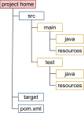
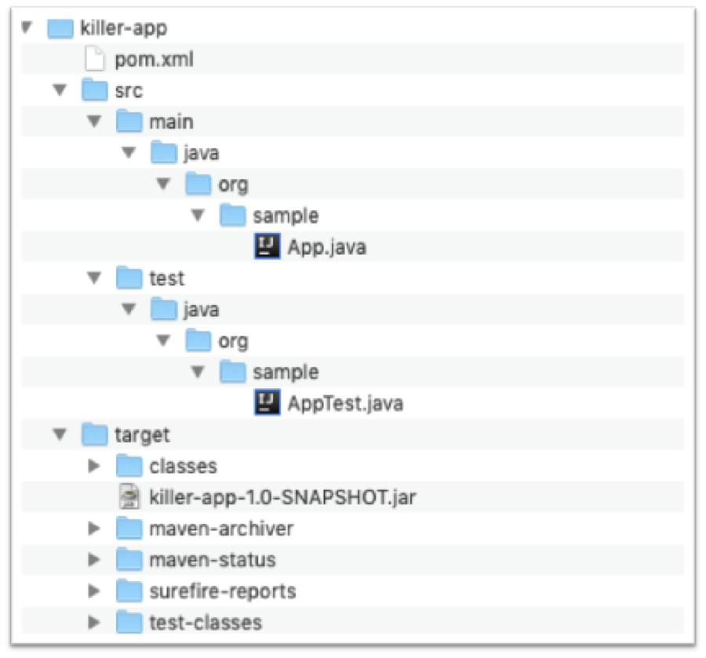
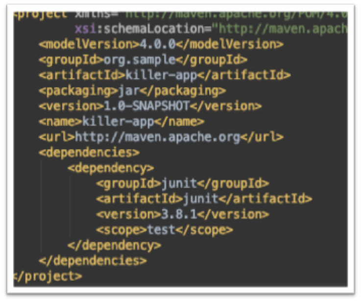

class: center, middle

# S01E01 - Introduction à Maven

## Comprendre Maven

---

# Maven - Saison 1

- S01E1 : Le coeur de Maven
- S01E2 : Les plugins, les dépendances, les repositories
- S01E3 : Multi-module
- S01E4 : Describe Once, Build Everywhere
- S01E5 : Packaging

---

# Une brève histoire

## Les outils

- .focus[Make (1976), ant (2000)]  
  Make très orienté "langage C".  
  Ant (2000), scripts procédural en XML (complexe), pas de gestion native de dépendance (nécessite Apache Ivy)

- .focus[Maven (2004)]  
  XML mais déclaratif, gestion de dépendance

- .focus[Gradle (2012)]  
  DSL groovy, plus concis  
  Adopté par Google comme outils de build pour Android

--

.focus-high[
La force de maven : [_Convention over configuration_](https://en.wikipedia.org/wiki/Convention_over_configuration) 
]
Tout le monde adopte les mêmes conventions, on ne précise que le spécifique.

---


En une phrase courte, Maven produit un artifact et le met à disposition dans une repository.

En un peu plus alambiqué, un module Maven construit, de manière .focus-high[standard], un .focus-high[artifact] à partir des .focus-high[sources] locales et de .focus-high[dépendences] issue de la .focus-high[repository], et distribue l'artifact dans une repository.

--

Selon Maître Ioda, pour devenir un Jedi de Maven :

- L'organisation de ton projet Maven, tu adopteras
- Le processus de build Maven, tu adopeteras
- Dans une repository Maven, ton artifact tu déposeras

---

# Conventions

Un projet Maven :

```shell
mvn archetype:generate -DgroupId=org.sample -DartifactId=killer-app
 -DarchetypeArtifactId=maven-archetype-quickstart -DinteractiveMode=false
```




---

# Maven phases and goals

Maven automatise la création d'un _artifact_ (projet) en s'appuyant sur un cycle de vie de construction (**_build lifecycle_**). Maven en définit 3 : clean, default et site.

Les _build lifecycles_ sont découpés en **_phases_**.

Les principales phases du cyle par défaut :

- .focus-high[`validate`] : vérifie que la configuration projet est correcte (POM, pas d'éléments manquants...)
- .focus-high[`compile`] : compile les sources du projet
- .focus-high[`test`] : teste le code compilé avec les classes de tests unitaires contenues dans le projet
- .focus-high[`package`] : package les éléments issus de la compilation dans un format distribuable (JAR, WAR...)
- .focus-high[`install`] : installe le package dans votre repository local
- .focus-high[`deploy`] : envoie le package dans le repository distant défini dans le POM

Chaque phase est une séquence de **_goals_** qui sera exécuté dans l'ordre.

.focus[
[Lifecycle Reference](http://maven.apache.org/guides/introduction/introduction-to-the-lifecycle.html#Lifecycle_Reference)
]

---

# Maven plugins goals

Maven est, basiquement, un moteur d'exécution de plugins. Les plugins se tapent tout le boulot.

Plus exactement, Maven exécutent les **_goals_** (des tâches) des plugins. Une analogie : un plugin est une classe (Maven les nomme MOJO) et les goals sont des méthodes.

Quand Maven "déroule" une phase, il exécute tous les goals associés à cette phase.

Par exemple,

- compiler:compile – Le goal `compile` du plugin `compiler` est associé à la phase compile.
- compiler:testCompile - `testCompile` est associé à la phase test.

--

```shell
mvn mvn help:describe -Dcmd=compile
mvn help:describe \
    -DgroupId=org.apache.maven.plugins \
    -DartifactId=maven-compiler-plugin
```

.focus[
[les principaux plugins](https://maven.apache.org/plugins/)
]

---

# POM

Au minimum :

```xml
<project>
  <modelVersion>4.0.0</modelVersion>
  <groupId>com.mycompany.app</groupId>
  <artifactId>my-app</artifactId>
  <version>1</version>
</project>
```

packaging :

```xml
  <packaging>jar</packaging>
```

.focus[
[POM introduction](https://maven.apache.org/guides/introduction/introduction-to-the-pom.html)
]

---

# To be continued

Dans le prochain épisode, vous décrouvirez

- comment utiliser un plugin
- comment gérer vos dépendances.
- une introduction au repositories
