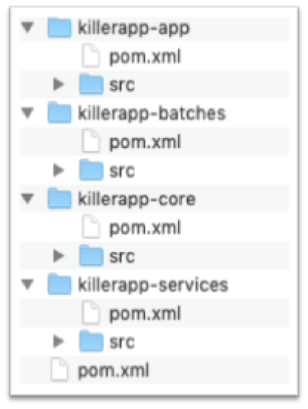

class: center, middle

# S01E02 - Maven

## Multi-module

---

# Maven - Saison 1

- S01E1 : Le coeur de Maven
- S01E2 : Les plugins, les dépendances, les repositories
- S01E3 : Multi-module
- S01E4 : Describe Once, Build Everywhere
- S01E5 : Packaging

---

# POM Parent

Un projet Maven multi-module gère un groupe de sous-modules.

Dans la majorité des cas, le pom "parent" est à la racine du projet. Son _packaging_ est de type pom.

Les sous-modules sont des projets Maven "classiques". Ils peuvent être contruits indépendemment ou globalement.

```xml
<project>
[...]
  <groupId>me.sample</groupId>
  <artifactId>killerapp</artifactId>
  <version>1.0.0-SNAPSHOT</version>
  <packaging>pom</packaging>

  <modules>
    <module>killerapp-core</module>
    <module>killerapp-services</module>
    <module>killerapp-app</module>
    <module>killerapp-batches</module>
  </modules>
</project>
[...]
```

---

# Structure classique



--

D'autres organisations sont possibles. Par exemple [flat](http://www.codetab.org/tutorial/apache-maven/multi-module/hierarchical-project/).

---

# Gestion des dépendances

### Dependency Management

Dans le pom parent :

```xml
[...]
  <dependencyManagement>
    <dependencies>
      <dependency>
          <groupId>org.apache.commons</groupId>
          <artifactId>commons-lang3</artifactId>
          <version>${commons-lang3.version}</version>
      </dependency>

      <dependency>
          <groupId>me.sample</groupId>
          <artifactId>killerapp-services-api</artifactId>
          <version>${project.version}</version>
      </dependency>
  <dependencyManagement>
[...]
```

--
.focus-high[Pas de scope dans `<dependencyManagement>`]

---

# Gestion des dépendances

Ou dans un module dédié (`killerapp-dep/pom.xml`), puis dans le pom parent ou dans le sous-module :

```xml
[...]
  <dependencyManagement>
    <dependencies>
      <dependency>
          <groupId>me.sample</groupId>
          <artifactId>killerapp-dep</artifactId>
          <version>${project.version}</version>
          <scope>import</scope>
          <type>pom</type>
      </dependency>
  <dependencyManagement>
[...]
```

--
.focus[
Pour en savoir plus sur la notion de BOM avec Maven, un article de [Xebia](https://blog.xebia.fr/2014/02/28/la-notion-de-bom-avec-maven/).
]

---

# Gestion des dépendances

Dans les sous-modules, la version n'est plus précisée, mais le scope oui :

```xml
<dependency>

    <dependency>
        <groupId>org.apache.commons</groupId>
        <artifactId>commons-lang3</artifactId>
    </dependency>

    <dependency>
      <groupId>junit</groupId>
      <artifactId>junit</artifactId>
      <scope>test</scope>
    </dependency>

</dependency>
```

---

# Gestion des plugins

La section `<pluginManagement>`

```xml
  <build>
    <pluginManagement>
      <plugins>

        <plugin>
          <groupId>org.apache.maven.plugins</groupId>
          <artifactId>maven-compiler-plugin</artifactId>
          <version>3.8.1</version>
        </plugin>

        <plugin>
          <groupId>org.apache.maven.plugins</groupId>
          <artifactId>maven-source-plugin</artifactId>
          <version>3.1.0</version>
          <executions>
            <execution>
              <id>attach-sources</id>
              <goals>
                <goal>jar</goal>
              </goals>
            </execution>
          </executions>
        </plugin>
      </plugins>

    </pluginManagement>
  </build>
```

---

# Héritage des propriétés

```xml
  <properties>

    <nexus.url>http://nexus.altair.recouv/nexus/content</nexus.url>

    <svn.tag.url>http://svn.altair.recouv/svn/gci/tags/releases</svn.tag.url>

  </properties>
```

--
Attention aux propriétés fournissant des chemins relatifs :

```xml
    <property.filter>${project.basedir}/../killerapp-configuration/
    src/main/filters/${env}-filter.properties</property.filter>
```

--
.focus[
Pour voir le pom effectif : `mvn help:effective-pom`
]

---

# Build

Build global

```shell
cd killerapp
mvn clean install
```

Si le build d'un des modules a échoué

```shell
mvn clean install -rf :killerapp-services
```

Ou build séparé

```shell
cd killerapp/killerapp-services
mvn clean install
```

---

# To be continued

La semaine prochaine, comment faire un build qui marche sur mon poste, sur le poste Jean, de Jenkins...
