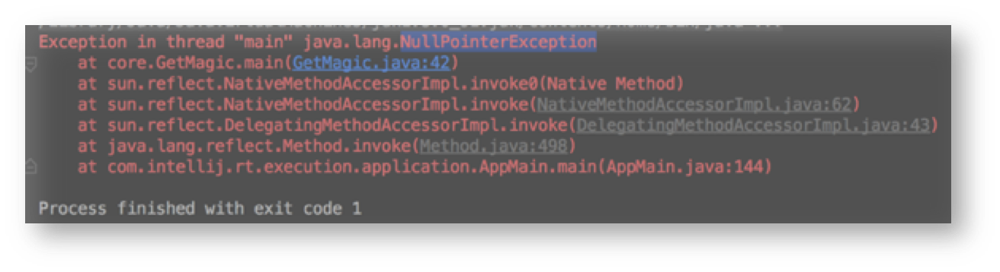
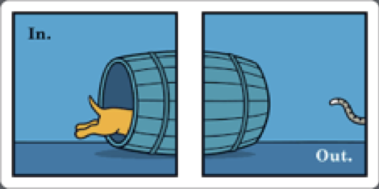

class: center, middle

# NullPointerException

## La chasse aux NullPointerExceptions

---

# NullPointerException

> <i>I call it my billion-dollar mistake. It was the invention of the null reference in 1965… This has led to innumerable errors, vulnerabilities, and system crashes, which have probably caused a billion dollars of pain and damage in the last forty years.</i>
>
> <cite>Sir Charles Antony Richard Hoare, inventor of the Null Reference</cite>



---

# Deux règles seulement



1. Les autres, c’est l’enfer  
   .focus[Je contrôle ce que je laisse passer ou pas]

2. Les autres, c’est l’enfer  
   .focus[Je contrôle les méthodes que j’utilise]

3. Pierre qui roule n’amasse pas mousse  
   Ca fait 3, mais celle la n’a rien à voir, c’est juste pour dire, qu’en fait, il n’y a qu’une règle : .focus-high[anticiper].

.focus[
Anticiper les erreurs que les autres vont commettre.
Tip : on est tous l'autre de quelqu'un.
]

---

# Validez, prévenez

### Contrôler

```java
public void doSomeThing(Thing thing) {
  Objects.requireNonNull(thing, "You must give something");
  …
}
```

### Dites le avec des fleurs

```java
public void doSomeThing(@Nonnull Thing thing) {
  Objects.requireNonNull(thing, "You must give something");
  …
}
```

.see-also[

- Objects fait partie du JDK depuis la version 1.7.
- Autre choix la classe org.springframework.util.Assert (plus complète)
  ]

---

# C'est en option

### Dites le aussi avec des fleurs

```java
public void order(Pizza pizza) {
  order(thing, DEFAULT_TOPPINGS, Drink.NO_DRINK);
}
public void order(Pizza pizza, Drink drink) {
  order(thing, DEFAULT_TOPPINGS, drink);
}
public void order(Pizza pizza, Topping[] toppings) {
  order(thing, toppings, Drink.NO_DRINK);
}
public void order(Pizza pizza, Topping[] toppings, Drink drink) {
 Objects.requireNonNull(pizza, "A pizza is mandatory");
 Objects.requireNonNull(toppings, "I need to know toppings you want");
 Objects.requireNonNull(drink, "drink is null");
 …
}
```

.see-also[
Quand un développeur ("l'Autre") utilisera l'auto-complétion de son IDE favoris, il saura que plusieurs
options existent. Il choisira la signature de méthode qu'il lui convient.

Peu de chance qu'il commande une pizza et une boisson nulle alors qu'il a un méthode de commander
une pizza seule.
]

---

# Par ici la sortie

### Chose vue

```java
public Integer getCountOfThing(Kind kindOfThing) {
  // ...
}
 // ... Further
  count = getCountOfThing(Kind.ThisOne);
  if (count > 0) {
  }
```

Les mots ont un sens. Demandez à quelqu'un combien il a de pièces de 1 euros dans sa poche.
S'il en a aucune, il répondra 0. Il y a peu de chance qu'il parte en courant.

Il a y donc pas mal de chance que le développeur (l'Autre) qui utilise la méthode `getCountOfThing`
ne s'attende pas à recevoir une valeur nulle. Il ne testera pas le retour.

---

# Par ici la sortie

### Chose vue aussi

```java
  BadGuy badGuy = findBadGuyByName(name);
  badGuy.arms().attach();
  badGuy.catch();
  kill(badGuy);

  List<BadGuy> badGuys = findBadGuyByCity(city);
  kill(badGuys);
```

Les mots ont un sens. Un "méchant" sans bras ?

---

# Dites le avec des mots

### Soyez explicite

```java
public Optional<Thing> findThing() {
  // …
  if (notFound) {
    return Optional.empty();
  }
  return Optional.of(thing);
  // ou return Optional.ofNullable(thingThasCanBeNull);
}

  Optional<Thing> optionalThing = findThing();
  if (optionalThing.isPresent()) {
    // do something
  }
```

Optional = Je peux retourner `null`. Voilà, toi, l'Autre, t'es prévenu.

---

# Vide, c’est pas rien

### Retournez une collection vide plutot que rien

```java
public List<Thing> findAll() {
  List<Thing> things = new ArrayList<>();
  Thing thing = null;
  do {
    thing = findNextThing();
    if (thing != null) {
     things.add(thing);
    }
  } while (thing != null);
  return things;
}

  List<Thing> things = findAll();
  if (!things.isEmpty()) {
    // do something
  }
```

---

# Evitez les nuls

```java
public Integer getSomeMustHaveParameter() {
  Integer param = params.get("theParam");
  return param;
}
```

peut devenir

```java
public class AppParam {

  private Map<String, Integer> params = new HashMap<>();

  public AppParam() {
    loadParameters();
  }

  // loads application parameters
  private void loadParameters() {
    Integer param = load("theParam");
    if (param == null) {
      throw new RunTimeException("Sorry, guy! I really need this parameter");
    }
    params.put("theParam", param);
  }
  public int getSomeMustHaveParameter() {
    Integer param = params.get("theParam");
    // cannot be null
    return param;
  }

}
```

---

# Evitez les nuls

### Et pourquoi pas des valeurs par défaut ?

```java
public Param getSomeMustHaveParameter() {
  Param param = params.get("theParam");
  if (param == null) {
    param = Param.DEFAULT;
  }
  return param;
}
...
public class Person {
  private final String lastName;
  private final String firstName;
  private final String nickName;

  public Person(String lastName, String firstName, String nickName) {
    this.lastName = Optional.ofNullable(lastName).orElse("");
  }
  ...
```

.focus[Attention! Choisir une valeur par défaut n'est pas anodin. Cela doit être validé par le métier]

---

# Empathie

Les erreurs `NullPointerException` arrivent toujours parce qu'on n'a pas prévu que cela pouvait
arriver.

Et parfois, parce que le développeur utilise une méthode qu'il croit, de bonne foi, ne pas pouvoir
retourner une référence nulle.  
Parfois à cause de son nom (`getCount`).  
D'autres fois, parce la méthode est mal documentée ou d'utilisation compliquée (mal conçue)...

Le mieux pour éviter les `NullPointerException` est d'anticiper en se mettant à la place du développeur
qui utilisera votre code.

L'écriture de tests unitaires est la bonne place pour cet exercie d'empathie.
Vous êtes alors le premier utilisateur de votre code. Si l'écriture du test est difficile,
peut-être faut-il le revoir.

.focus-high[Bonne anticipation.]
